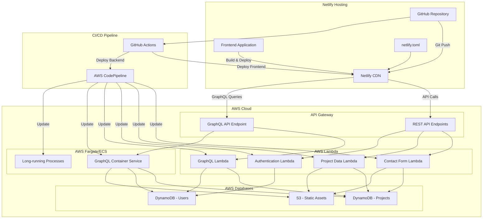

# Portfolio Architecture Diagram

## Component Descriptions

### Frontend (Netlify)
- **React/Next.js Application**: TypeScript-based, responsive design
- **Netlify CDN**: Global content delivery network for fast loading
- **netlify.toml**: Configuration for build settings, redirects, and environment variables
- **GitHub Repository**: Source code with automated deployment on push to main branch

### Backend (AWS)
- **API Gateway**: Manages both REST and GraphQL endpoints
- **Lambda Functions**:
  - Contact Form: Processes submissions, sends emails
  - Project Data: Retrieves and manages portfolio project information
  - Authentication: Handles secure user authentication (if needed)
  - GraphQL Lambda: Processes simpler GraphQL queries
- **Fargate/ECS**: Contains Docker containers for services requiring more processing power
  - GraphQL Container: Handles complex GraphQL operations
  - Long-running Processes: Background jobs, analytics, etc.
- **Databases**:
  - DynamoDB - Projects: Stores portfolio project data
  - DynamoDB - Users: Manages user authentication (if applicable)
  - S3 - Static Assets: Stores images, documents, and other static content

### CI/CD Pipeline
- **GitHub Actions**: Automates frontend build and deployment to Netlify
- **AWS CodePipeline**: Manages backend deployments to Lambda and ECS 